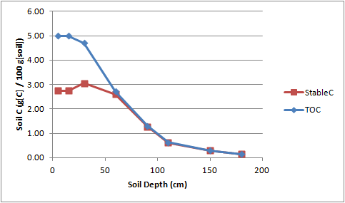

# STABLEC - Stable C fraction distribution in soil layers

### Inputs:
* SOM3_0 = fraction of total soil organic C which is stable, at surface (fraction)
* PP = depth of topsoil where maximum SOM3 fraction is relatively constant (cm)
* RD = depth at which soil C is relatively stable (~98% stable C) (cm)

### Implicit Inputs (i.e., available in the data):
* SLLB = array of depths to bottom of soil layer (cm)
* SLOC = array of total organic C (g[C]/100 g[soil])

### Outputs:
* SLSC = array of Stable C (g[C]/100g[soil])

### Procedure:
1.	Calculate SOM2 fraction at surface 
    ```Fortran
    SOM2_0 = 0.95 * (1 - SOM3_0)
    ```
2.	Call Root_dist function with PP, M=SOM2_0, RD, returns F
3.	Calculate array SOM2_frac(j) = MAX (0.02, F(j))
4.	Calculate array SOM3_frac(j) = 1 - SOM2_frac(j) / 0.95
5.	Calculate array StableC(j) = TOC(j) * SOM3_frac(j)

### Example:
```
FILL, SLSC, STABLEC(), 0.55, 20, 60
```

#### Input:
```
TOC_0 = 5 (g[C]/100 g[soil])
SOM3_0 = 0.55 (fraction of TOC)
PP = 20 (cm)
RD = 60 (cm)
```

#### Root distribution function parameters:
```
M = 0.4275
PP = 20
RD = 60
k = -0.0978
```

#### Calculation of stable C:
| sllb | TOC | mid | F | SOM2_frac | SOM3_frac | StableC |
| - | - | - | - | - | - | - |
| 5 | 5.00 | 2.5 | 0.428 | 0.428 | 0.550 | 2.75 |
| 15 | 5.00 | 10 | 0.428 | 0.428 | 0.550 | 2.75 |
| 30 | 4.70 | 22.5 | 0.335 | 0.335 | 0.648 | 3.05 |
| 60 | 2.71 | 45 | 0.037 | 0.037 | 0.961 | 2.61 |
| 90 | 1.30 | 75 | 0.002 | 0.020 | 0.979 | 1.28 |
| 110 | 0.63 | 100 | 0.000 | 0.020 | 0.979 | 0.61 |
| 150 | 0.30 | 130 | 0.000 | 0.020 | 0.979 | 0.29 |
| 180 | 0.14 | 165 | 0.000 | 0.020 | 0.979 | 0.14 |



### More Samples:
The following DOME spreadsheet is using this function.
[Machakos Overlay DOME](https://github.com/agmip/json-translation-samples/blob/master/Maize_Machakos/raw/Field_Overlay-Machakos-MAZ.xlsx?raw=true)

[Dome functions page](DOME_functions.md)

[Home](index.md)


